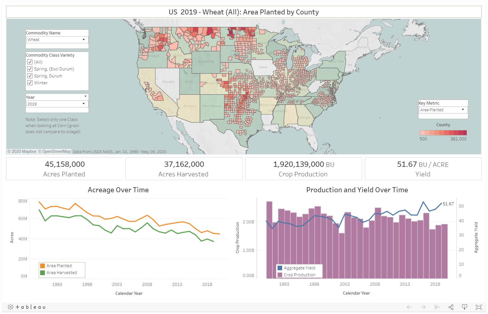

# Indigo Data Analyst Case Study

## Goal

Create a high quality dashboard that can help stakeholders answer agricultural questions around different counties in the United States for a focused set of crops. The dashboard should enable simple navigation that allows business users to look at specific crops and understand their national trends over time for area planted, area harvested, production, and yield.

## Result

A dashboard created for Tableau Public can be found linked in the checklist below along with a cleaned dataset! 

## Items to Prepare Checklist

- [x] [Data preparation (saved to this GitHub repository)](sql/clean_script/data_preparation_clean.sql)
- [x] [Cleaned dataset](output-data/ag_exp_clean_county.txt.gz)
- [x] [Interactive dashboard to explore the cleaned dataset (Tableau)]((https://public.tableau.com/profile/matthew.lim3502#!/vizhome/USAgriculture_15891807504100/UnitedStatesAgriculture))
- [ ] 4. Brief explanation of how I tackled this task
  - [ ] slides
  - [x] writeup / walk-through

## Approach and Design Workflow

I tried to keep in mind the overall end goal for every step of the workflow. Thinking about the final dashboard output, the software tool needed to handle plotting county level data.

## 1. Data Preparation and Cleansing

Need to download the NASS QuickStats data first. Some data exploration will help with familiarization of the dataset. Will potentially come across some odd or unexpected datapoints. 

### Preliminary data checks

After downloading and saving the data into a default download folder on windows.

Running the follow commands in Powershell returns some basic info about the data including column headers and row counts in the file:

```powershell
cd $env:USERPROFILE\downloads

# column headers from sample file unzipped
$data = import-csv .\qs.sample.txt
$data[0].PSObject.Properties.Name

# header and a handful of files from the sample file unzipped
get-content -path .\qs.sample.txt -totalcount 5

# row count from master file - this will take awhile
Import-csv .\qs.crops_20200506.txt | Measure-Object | Select-Object -expand count
```

<details><summary> One Row Sample Output </summary>

SOURCE_DESC|SECTOR_DESC|GROUP_DESC |COMMODITY_DESC|CLASS_DESC           |PRODN_PRACTICE_DESC     |UTIL_PRACTICE_DESC       |STATISTICCAT_DESC|UNIT_DESC            |SHORT_DESC                                                               |DOMAIN_DESC   |DOMAINCAT_DESC                                |AGG_LEVEL_DESC|STATE_ANSI|STATE_FIPS_CODE|STATE_ALPHA|STATE_NAME    |ASD_CODE|ASD_DESC                   |COUNTY_ANSI|COUNTY_CODE|COUNTY_NAME              |REGION_DESC|ZIP_5|WATERSHED_CODE|WATERSHED_DESC|CONGR_DISTRICT_CODE|COUNTRY_CODE|COUNTRY_NAME |LOCATION_DESC                                                  |YEAR|FREQ_DESC    |BEGIN_CODE|END_CODE|REFERENCE_PERIOD_DESC|WEEK_ENDING|LOAD_TIME          |VALUE     |CV_PERCENT|
-----------|-----------|-----------|--------------|---------------------|------------------------|-------------------------|-----------------|---------------------|-------------------------------------------------------------------------|--------------|----------------------------------------------|--------------|----------|---------------|-----------|--------------|--------|---------------------------|-----------|-----------|-------------------------|-----------|-----|--------------|--------------|-------------------|------------|-------------|---------------------------------------------------------------|----|-------------|----------|--------|---------------------|-----------|-------------------|----------|----------|
SURVEY     |CROPS      |FIELD CROPS|WHEAT         |SPRING, (EXCL DURUM) |ALL PRODUCTION PRACTICES|ALL UTILIZATION PRACTICES|AREA HARVESTED   |ACRES                |WHEAT, SPRING, (EXCL DURUM) - ACRES HARVESTED                            |TOTAL         |NOT SPECIFIED                                 |COUNTY        |38        |38             |ND         |NORTH DAKOTA  |20      |NORTH CENTRAL              |           |998        |OTHER (COMBINED) COUNTIES|           |     |00000000      |              |                   |9000        |UNITED STATES|NORTH DAKOTA, NORTH CENTRAL, OTHER (COMBINED) COUNTIES         |2019|ANNUAL       |00        |00      |YEAR                 |           |2019-12-12 15:00:24|433,100   |          |

</details>

### Data preparation - SQL

#### Snowflake

SQL and Snowflake shine for data preparation. Snowflake SQL in particular offers easy ways to quickly import large amounts of data, do any necessary transformations, and easily export the data back out.

#### Aggregations

The final dataset needed a format easily interpretable by a software as well as a human. Focused on getting data on any one row to represent year, sate-county, crop & variety while aggregating stats for area planted, area harvested, production, and yield at the same level.

#### Transformations

Add detail where necessary while also remaining frugal about information to include. Preserve raw data where possible and limit modifications unless necessary (save column names and raw data)
  
### Cleaned Dataset

The table includes eight user-friendly columns to identify:

* Year
* State
* County
* Crop
* Variety
* Area planted
* Area harvested
* Production
* Yield


## 2. Interactive Data Visualization

A wide variety of software options exist for building dashboards. We want to pick an option that allows for displaying information geographically on a map and has filtering functionality. Considering options particularly that enable users to easily interact with the data without any additional setup and tools that have ease of sharing capabilities. 

Some possible options include:

* Tableau
* Google Data Studio
* Jupyter Notebook

#### Tool Selection

 Tableau fit the criteria needed for this dashboard with its filtering and visual capabilities. Tableau Public also offers a free tool that provides easy access and sharing while also having geographical plotting capabilities to the county level.

#### Dashboard - Limited Space

The dashboard should look and behave intuitively for an individual unfamiliar with the information presented. The design should ideally have little clutter and draw the attention of users to important details. While everyone moves at a different pace, the visuals should provide enough information to help a user along and digest new knowledge. Enabling a user to dive into a specific element can come as a bonus after primarily highlighting important trends and facts.


## 3. Presentation

This writeup exists to help guide and navigate the work for this case study!

## Appendix: Additional Datasets

Other dataset resources to potentially add or utilize:

* [FIPS Codes from the US Census Bureau (2018)](https://www.census.gov/geographies/reference-files/2018/demo/popest/2018-fips.html)
* [Atlas of Rural and Small-Town America](https://www.ers.usda.gov/data-products/atlas-of-rural-and-small-town-america/)

## Appendix: Dashboard Tools Comparison

### Tableau

#### Tableau Pros

The program has good customizations and tableau public allows easy access, has county level geographical setup that can use FIPS codes available in the data provided by NASS USDA.

#### Tableau Cons

Dashboard setup can be clunky and difficult to maintain, difficulties with backward compatibility and version control.

### Google Data Studio

#### Data Studio Pros

Simple to use and easy to share.

#### Data Studio Cons

Limited customization, limitations plotting geographical data for [counties.](https://support.google.com/datastudio/answer/7065037?hl=en) ~~Supports county level geographical visuals~~.

### Jupyter Notebook

#### Jupyter Notebook Pros

Customizable and allows more control of visuals.

#### Jupyter Notebook Cons

Heavier lift to setup and possibly intimidating for users unfamiliar to the environment, also a larger lift to setup county plots.

## Appendix: Observations

<details><summary></summary>

* Cotton yield has grown over time despite ups and downs in acres harvested and acres planted.
  * Cotton production has possibly become more efficient?
* Soybeans do not grow west of texas.
* Wheat Production Decline

</details>

## Appendix: Business Use Cases

<details><summary></summary>

* Understanding Crop Trends
* Identifying regions of growth and decline for different crops
  * Shifts locations growing crops

</details>

## Appendix: Thoughts for Other Data or Supplemental Dashboards

<details><summary></summary>

* Imports and exports of these crops to other countries may help understand some of these trends.
* The NASS QuickStats data set does not include prices received at the county level, but we could look at this metric on the state or natoinal level
  
</details>

## Appendix: Tableau Dashboard Preview

<details open><summary> </summary>



</details>